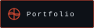
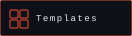
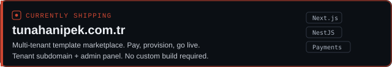
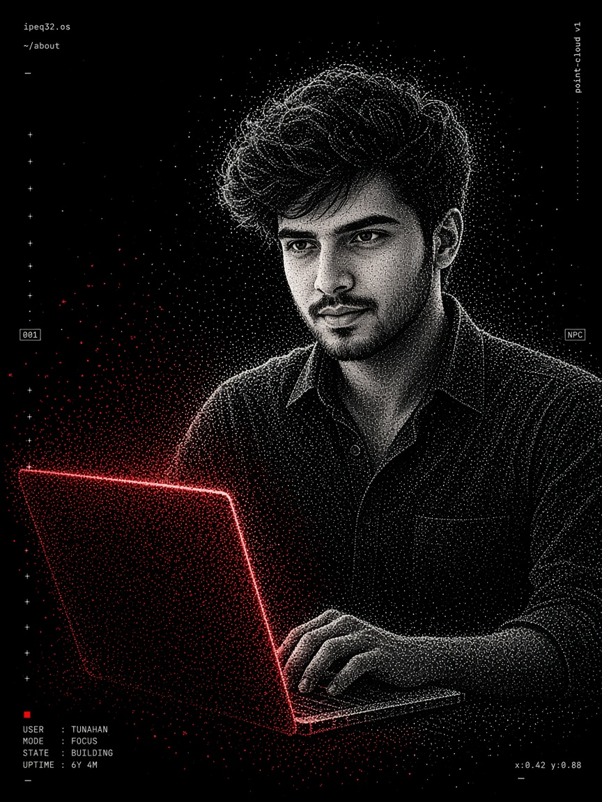
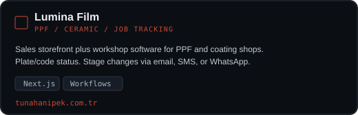
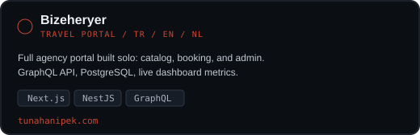
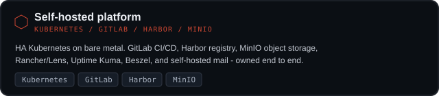
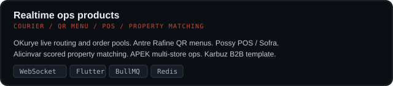

<table>
<tr>
<td width="52%" valign="top">

```
 user   : tunahan ipek
 role   : senior full-stack · devops architect
 stack  : typescript · next.js · nestjs · kubernetes
 status : independent · shipping products
```

 <sub>still compiling…</sub>

Senior full-stack engineer and DevOps architect in Denizli, Turkey. I design and operate production systems end to end — Next.js and NestJS products, GraphQL/PostgreSQL data layers, Flutter and React Native clients, and high-availability Kubernetes on bare metal.

I currently ship my own products: a multi-tenant template marketplace, clinic SaaS, realtime courier/QR/POS stacks, and a self-hosted GitLab–Harbor–MinIO platform. Previously I led frontend, backend, mobile, and AI delivery as a technical team lead.

<a href="https://tunahanipek.com"></a>&nbsp;
<a href="https://tunahanipek.com.tr"></a>&nbsp;
<a href="https://blog.tunahanipek.com"></a>&nbsp;
<a href="https://linkedin.com/in/tunahanipek"></a>&nbsp;
<a href="mailto:tnhnipek@gmail.com"></a>

<br/><br/>


<br/>


<br/><br/>

<a href="https://tunahanipek.com.tr"></a>

</td>
<td width="48%" align="right" valign="top">

</td>
</tr>
</table>

<p align="center">
  
</p>

---

<div align="center">

### Signature products

<table>
  <tr>
    <td width="50%"><a href="https://tunahanipek.com.tr"></a></td>
    <td width="50%"><a href="https://tunahanipek.com.tr"></a></td>
  </tr>
  <tr>
    <td width="50%"><a href="https://tunahanipek.com"></a></td>
    <td width="50%"><a href="https://tunahanipek.com"></a></td>
  </tr>
  <tr>
    <td colspan="2" width="100%"><a href="https://tunahanipek.com"></a></td>
  </tr>
  <tr>
    <td colspan="2" width="100%"><a href="https://tunahanipek.com"></a></td>
  </tr>
</table>

</div>

---

<div align="center">

### Signals


<p>
  
  
</p>

</div>

---

<p align="center">
  <sub><code>ipeq32.os · independent · denizli / remote</code></sub>
</p>
