<table>
<tr>
<td width="52%" valign="top">
<pre>
 user   : tunahan ipek
 role   : senior full-stack / devops architect
 stack  : typescript / next.js / nestjs / kubernetes
 status : independent / shipping products
 loc    : denizli / remote
</pre>
 still compiling...
 

  
I architect production platforms and own them in operation — web, API, mobile, data, and the Kubernetes they run on.
  
<a href="https://tunahanipek.com">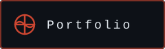</a>
<a href="https://tunahanipek.com.tr">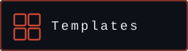</a>
<a href="https://blog.tunahanipek.com">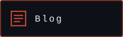</a>

  

</td>
<td width="48%" valign="top">
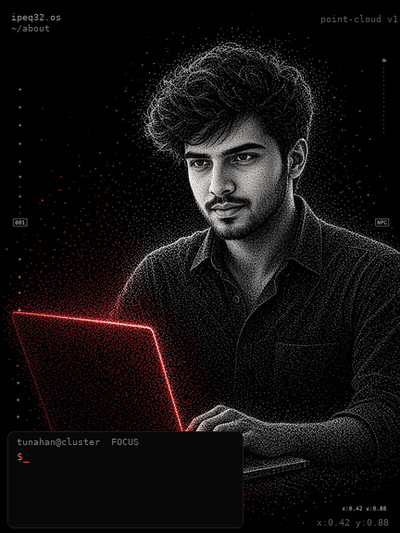
</td>
</tr>
</table>

  

---

**Now shipping** — [tunahanipek.com.tr](https://tunahanipek.com.tr)

<a href="https://tunahanipek.com.tr">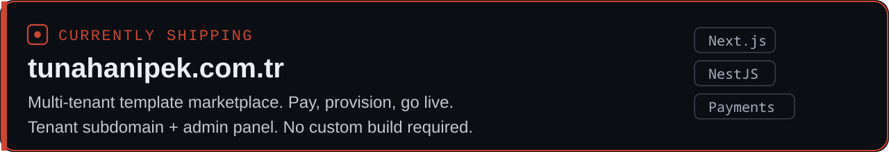</a>

Multi-tenant marketplace for ready-made business sites. The buyer picks a template, pays, and gets a provisioned tenant (`your-business.tunahanipek.com.tr`), an admin panel, and optional custom domain — without a custom build.

Catalog today:

- **SiteForge** — cafe / bakery storefront (menu, locations, brand story)
- **Karbuz** — frozen-food B2B catalog and inquiry flow
- **Lumina Film** — PPF / ceramic storefront plus job tracking (plate/code status, email / SMS / WhatsApp)

Stack: Next.js, NestJS, secure checkout, automated provisioning.

---

**Selected products** — [tunahanipek.com](https://tunahanipek.com) · [tunahanipek.com.tr](https://tunahanipek.com.tr)

<table>
<tr>
<td width="50%" valign="top">
<a href="https://tunahanipek.com.tr">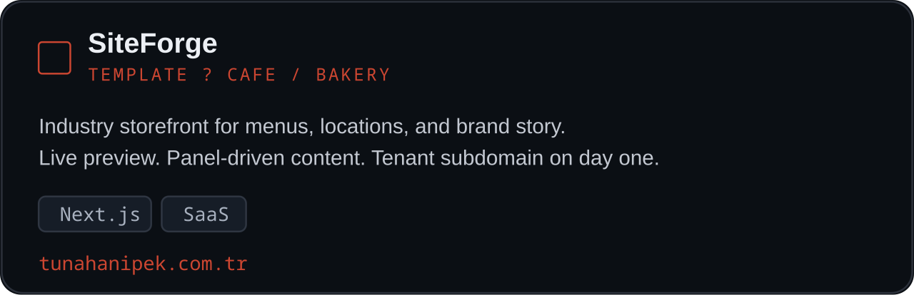</a>
</td>
<td width="50%" valign="top">
<a href="https://tunahanipek.com.tr">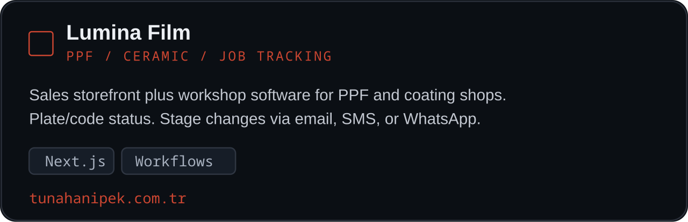</a>
</td>
</tr>
<tr>
<td width="50%" valign="top">
<a href="https://tunahanipek.com">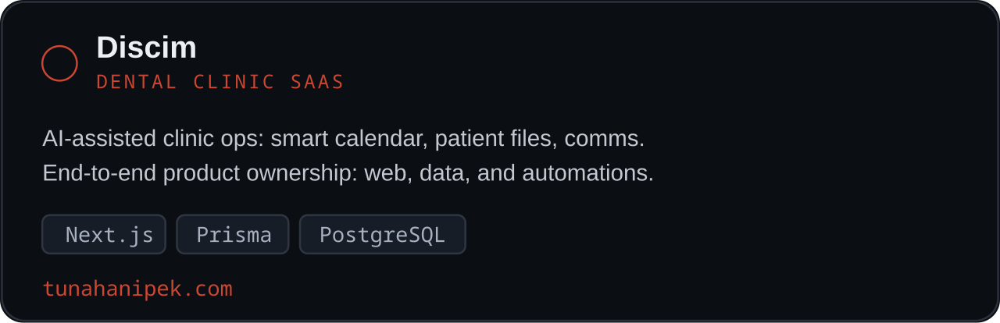</a>
</td>
<td width="50%" valign="top">
<a href="https://tunahanipek.com">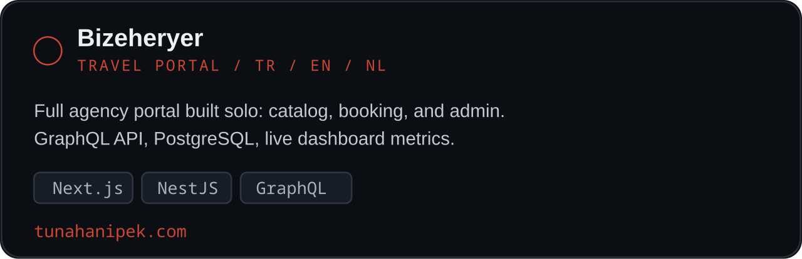</a>
</td>
</tr>
</table>

**Dişcim** is an AI-assisted dental clinic SaaS: smart calendar, patient files, clinic-assistant flows, automated patient communication. Next.js, Prisma, PostgreSQL, webhooks.

**Bizeheryer** is a trilingual (TR / EN / NL) travel-agency portal I built end to end: catalog, operations, admin metrics. Next.js, NestJS, GraphQL, PostgreSQL.

**APEK Panel** is a multi-store operations console: invoices, webhooks, Bull queues, domain verification, storefronts (orders, coupons, returns, shipping), API keys, mail templates, reporting.

**Alicinvar** matches property supply and demand with scored requests. NestJS, Redis, MinIO, BullMQ, Next.js.

---

  

<a href="https://tunahanipek.com">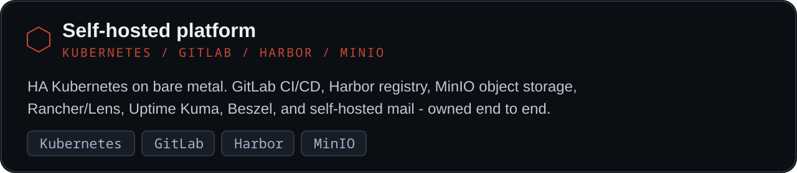</a>

I run HA Kubernetes on physical servers: GitLab + Runner, Harbor, MinIO, Rancher / Lens, Uptime Kuma, Beszel, Postfix / Dovecot. CI/CD and object storage are first-party, not rented dashboards.

Realtime and ops products on the same discipline:

- **OKurye** — live courier routing, order pools, commissions, marketplace-style integrations (Flutter + NestJS + WebSocket)
- **Sarı Express** — nationwide courier site (Next.js)
- **Antre Rafine QR Menu** — Next.js, NestJS, Prisma, MinIO, PostgreSQL, Redis
- **Possy POS / Sofra** — retail POS with printer/kitchen flows; home-cooked food marketplace
- **KSHUP** — Minecraft digital store (NestJS, Redis, PostgreSQL, Prisma, Next.js)

---

**How I work**

I take product ownership, not ticket slices. Typical delivery: domain model, API, UI, mobile where needed, payments, observability, and the deploy path. Preferences: clean architecture, TypeScript at the edges, PostgreSQL as source of truth, queues for work that should not live in the request.

Weekdays I am available roughly 08:00–16:00 Europe/Istanbul, remote.

**Recent roles**

- **Independent practice — platform & product architecture** (Jan 2026 – now). Courier/QR realtime systems, self-hosted platform, Dişcim, template marketplace.
- **Software team lead** — Ayhanlar Holding / İşin Olacak (2025). Led frontend, backend, mobile, and Python/AI delivery on Next.js, React Native, NestJS, GraphQL.
- **Freelance / contract** (2024–2025). NestJS and .NET APIs, Next.js sites, iyzico payment flows, legacy Node/PHP recovery.
- **Earlier full-stack work** (2019–2024). Agency and product delivery across travel, telecom backoffice, Figma-to-production UI, and e-commerce.

---

**Stack**

| Layer | Tools |
| --- | --- |
| Frontend / mobile | TypeScript, Next.js, React, React Native, Vue, Svelte, Flutter, Tailwind, Three.js |
| Backend / data | NestJS, Node.js, GraphQL, REST, PostgreSQL, Prisma, Redis, RabbitMQ, BullMQ, WebSocket, MinIO |
| Platform | Kubernetes, Rancher, Docker, GitLab CI/CD, Harbor, n8n |
| Also in production | Go, .NET, Java (Netty/Protobuf), Python, PHP/Laravel, iyzico |

---

**Signals**

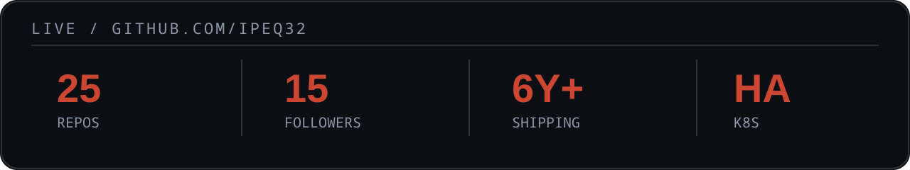

<table>
<tr>
<td width="50%" valign="top">

</td>
<td width="50%" valign="top">

</td>
</tr>
</table>

---

**Contact**

[tunahanipek.com](https://tunahanipek.com) · [tunahanipek.com.tr](https://tunahanipek.com.tr) · [blog](https://blog.tunahanipek.com) · [LinkedIn](https://linkedin.com/in/tunahanipek) · [tnhnipek@gmail.com](mailto:tnhnipek@gmail.com)

<code>ipeq32.os / independent / denizli / remote</code>

